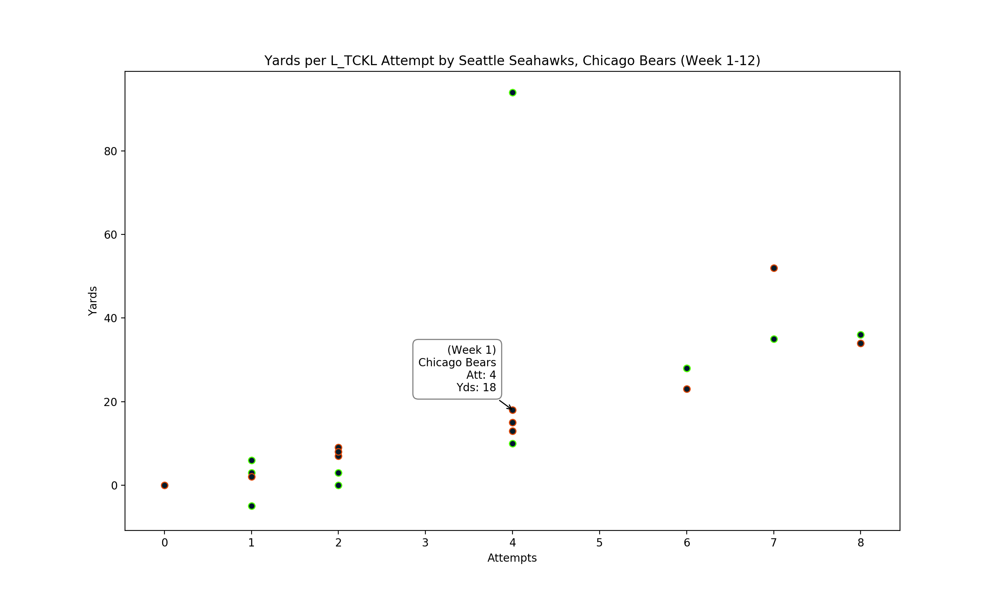

# NFL Data Crawl and Analysis

## Overview

Repository to project and visualize player performance based on historical data.

## Available Data

**Basic Data:**

* `boxscore-data` contains parsed components of boxscore data in CSV format
* `injuries` contains week by week injury data

**Advanced Metrics:**

* `priorities` defines players priorities by what actions they perform weighted against the total number of actions they perform. For example, this data would show that over _n_ snaps, running back _X_ runs off the left tackle 60% of the time.

**Miscellaneous:**

* `db.sqlite` relevant pieces of the repositories data in a sqlite3 database

## Basic Setup

Before cloning, create and activate a virtual environment using `venv`, **NOT** `virtualenv`, to ensure plotting libraries function properly:

```sh
python3 -m venv omaha-env       # create virtual environment
source omaha-env/bin/activate   # activate virtual environment
```

Then, clone the repository inside `omaha-env` and install the required dependencies:

```sh
pip install -r requirements.txt  # from ./omaha-env/omaha
```

## Visualizations

Visualizations are available for various pieces of the data, using simple command line interfaces.

### Defensive Efficacy

To visualize defensive efficacy (currently only for rush defense), use the `visualize-defense-efficacies.py` script:

```sh
python3 visualize-defense-efficacies.py <rush_dir> <game(s)> <team_name(s)?>
```

* `rush_dir` matches one of the `RUSH_TYPES` in `constants.py` (l_end, l_tckl, etc.)
* `game(s)` is a range of weeks, or a single week
* `team_name(s)?` is the name of a specific team or teams, matching one of the `TEAM_NAMES` in `constants.py`, to analyze (optional).

For example, the following command will show the rush yardage yielded on runs off the left tackle by the Seattle Seahawks' and Chicago Bears' defenses in weeks 1-12:

```sh
python3 visualize-defense-efficacies.py l_tckl 1-12 "Seattle Seahawks" "Chicago Bears"
```



## Running the Pipeline

All of the data built by the pipeline is provided in the repository. However, if you want to make tweaks to the structure and or build out new analytical models, you may need to run some or all of the pipeline. The following sections detail how to run the various components.

### Retrieval and Processing

In addition to the python requirements, the following are also needed:

* [bash](https://www.gnu.org/software/bash/) for executing scripts
* [curl](https://curl.haxx.se/) for requesting data

This section pertains to retrieval and processing of the data. All data come with the repository and will be periodically updated, but in the case that additional data is desired/required the pipeline is as follows:

To retrieve, parse, and process boxscore data:

```sh
bash get-weeks.sh              # get weekly schedules
python3 get-boxscore-links.py  # get links to boxscores from schedules
bash get-boxscores.sh          # retrieve boxscores
python3 parse-boxscores.py     # parse/post-processing data from boxscores
```

To do the same for injury data:

```sh
bash get-injuries.sh       # retrieve raw injury pages
python3 parse-injuries.py  # parse/post-process injury pages
```

And for players (requires processed boxscore data):

```sh
python3 get-player-links.py  # retrieve unique player links from snap counts
bash get-players.sh          # retrieves raw player pages
python3 parse-players.py     # parse/post-process player pages (combine data)
```

To populate the sqlite3 database with the CSV data:

```sh
python3 populate-db.py  # requires all of above data to populate db
```

Note that the tables in the database may have some additional columns to aid in joining tables. For example, some tables feature a game column so that offensive and defensive players from the same game can be compared.

### Advanced Data Generation

With all the raw data retrieved and processed, the more advanced data sets that will ultimately be used to build the analytical models can be generated.

To generate player priorities:

```sh
python3 player-priorities.py
```

Tp generate defensive efficacies (rushing and passing):

```sh
python3 defense-efficacy.py
```
